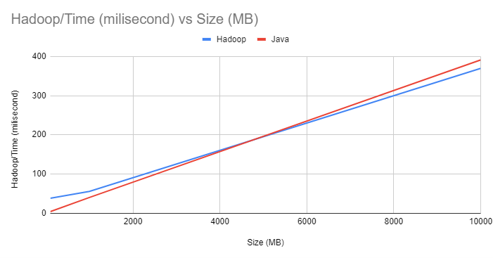

# Word Count Hadoop vs Java Comparison

This Project provides a comparison between implementing the word count functionality using Hadoop and Java. Both Hadoop and Java offer different approaches to handle large-scale data processing tasks, and this document aims to highlight the key differences and advantages of each approach.

Group 11:
1. Aldrian Raffi Wicaksono - 2106653256
2. Aliefya Fikri Ihsani - 2106733843
3. Rizki Awanta Jordhie - 2106655034
4. Shabrina Kamiliya Wiyana - 2106733894

## Hadoop Installation

This guide provides step-by-step instructions to install and configure Hadoop on a single-node (pseudo-distributed) setup. Follow these instructions to set up Hadoop on Ubuntu.

### Prerequisites
- Ubuntu operating system
- JDK 8 or higher installed
- Internet connectivity

#### Step 1: Download Hadoop
1. Go to the Hadoop release page on the Apache website.
2. Locate the download URL for Hadoop 3.3.2. For example: https://dlcdn.apache.org/hadoop/common/hadoop-3.3.2/hadoop-3.3.2.tar.gz
3. Open a terminal and use the wget command to download the Hadoop binary. For example: wget https://dlcdn.apache.org/hadoop/common/hadoop-3.3.2/hadoop-3.3.2.tar.gz

If you encounter certificate validation errors, you can use the --no-check-certificate option with wget to skip certificate validation.

#### Step 2: Unpack Hadoop
1. Create a directory to store the Hadoop files. For example:
  ```
  mkdir ~/hadoop
  ```
2. Unpack the downloaded Hadoop binary using the following command:
```
tar -xvzf hadoop-3.3.2.tar.gz -C ~/hadoop
```
3. Change the current directory to the Hadoop folder:
```
cd ~/hadoop/hadoop-3.3.2/
```

#### Step 3: Configure passphraseless SSH
1. Ensure that you can SSH to localhost without a passphrase. If necessary, install SSH using the following command:
```
sudo apt install ssh
```
2. Generate SSH keys and configure passphraseless SSH by running the following commands:
```
ssh-keygen -t rsa -P '' -f ~/.ssh/id_rsa
cat ~/.ssh/id_rsa.pub >> ~/.ssh/authorized_keys
chmod 0600 ~/.ssh/authorized_keys
```
If you encounter connection issues, you may need to restart the SSH service using the following command:
```
sudo service ssh restart
```


## Hadoop Word Count

Hadoop is an open-source framework that allows for distributed processing of large datasets across clusters of computers. It utilizes the Hadoop Distributed File System (HDFS) for data storage and the MapReduce programming model for data processing.

### Implementation Steps

1. **Input Splitting**: The input data is divided into chunks called "splits," and each split is assigned to a mapper for further processing.

2. **Mapping**: Each mapper processes its assigned split and generates intermediate key-value pairs. In the word count example, the mapper takes a chunk of text and emits each word as the key and the value 1.

3. **Shuffling**: The intermediate key-value pairs from all the mappers are sorted and grouped by key, ensuring that all the values for a particular key are together.

4. **Reducing**: Each reducer takes a group of key-value pairs with the same key and performs the desired aggregation operation. In the word count example, the reducer sums up the values associated with each word, resulting in the final word count.

### Advantages of Hadoop

- **Distributed Processing**: Hadoop allows for processing large datasets by distributing the workload across multiple machines in a cluster, which significantly improves performance and scalability.

- **Fault Tolerance**: Hadoop is designed to handle failures gracefully. If a machine fails during processing, the framework automatically redistributes the workload to other available machines, ensuring the job's completion.

- **Data Locality**: Hadoop optimizes data processing by bringing computation closer to the data. It attempts to schedule tasks on the same nodes where the data is stored, minimizing network traffic and improving performance.

- **Ecosystem**: Hadoop has a rich ecosystem of tools and libraries that extend its functionality. These include HBase, Hive, Pig, Spark, and many others, providing a wide range of data processing and analysis capabilities.

## Java Word Count

Java is a widely used general-purpose programming language known for its simplicity, reliability, and portability. Implementing word count in Java involves writing code to read input files, tokenize the text, and perform the necessary counting operations.

### Implementation Steps

1. **Reading Input**: Java code reads the input text file(s) and splits them into individual words. This can be achieved using standard Java I/O operations or third-party libraries.

2. **Tokenization**: The input text is tokenized, splitting it into individual words or tokens. Various string manipulation functions or regular expressions can be used for this purpose.

3. **Counting**: Each word is processed, and a count is maintained for each unique word encountered. The count can be stored in a data structure such as a HashMap or a custom implementation.

4. **Output**: Once the counting is complete, the results can be displayed or saved to an output file, depending on the requirements.

### Advantages of Java

- **Simplicity**: Java provides a simple and straightforward programming model for implementing word count. Developers familiar with Java can quickly write and understand the code.

- **Flexibility**: Java offers greater flexibility in terms of customizing the word count implementation to specific requirements. Developers have full control over the code and can easily extend it to handle additional functionalities.

- **Portability**: Java code can be executed on any platform that supports Java Virtual Machine (JVM), making it highly portable across different operating systems.

- **Integrated Development Environment (IDE) Support**: Java benefits from a wide range of powerful IDEs, such as Eclipse and IntelliJ IDEA

, which provide features like code completion, debugging, and profiling, making development more efficient.

## Analysis

We have conducted a comparison between the word count implementation using Hadoop and Java, measuring the execution time in milliseconds for different input file sizes. The chart below presents the results:



### Observations

1. **Execution Time**: In general, we can observe that the Java implementation outperforms Hadoop in terms of execution time for all tested input file sizes. As the input size increases, the gap between the two implementations becomes more pronounced.

2. **Scalability**: Interestingly, while Hadoop is known for its scalability and ability to handle large datasets, the provided results indicate that the Java implementation performs better across all input sizes. This suggests that for smaller-scale word count tasks, the overhead of setting up and managing a Hadoop cluster might outweigh the performance benefits.

3. **Consistency**: The Java implementation exhibits relatively consistent execution times across different input sizes. On the other hand, the Hadoop implementation shows varying execution times, likely due to the distributed nature of the processing and the associated overhead.

### Considerations

When choosing between Hadoop and Java for word count or similar tasks, several factors should be considered:

- **Data Size**: If dealing with very large datasets that cannot fit into memory, Hadoop's distributed processing capabilities become more advantageous.

- **Infrastructure**: Utilizing Hadoop requires setting up and maintaining a Hadoop cluster, which introduces additional complexity and resource requirements. In contrast, Java can be executed on a single machine or a small cluster without the need for specialized infrastructure.

- **Ecosystem**: If the word count task is part of a larger data processing pipeline that can benefit from other Hadoop ecosystem components, such as Hive, Pig, or Spark, choosing Hadoop might provide a more integrated and comprehensive solution.

- **Development Effort**: Java offers a simpler development experience, particularly for smaller-scale tasks. Hadoop, on the other hand, requires understanding and working with the MapReduce paradigm and related concepts.

It's important to carefully evaluate the specific requirements, constraints, and trade-offs of your use case to make an informed decision between Hadoop and Java for word count or similar data processing tasks.

## Conclusion

Both Hadoop and Java provide distinct approaches to implementing word count functionality. Hadoop excels in handling large-scale data processing tasks by leveraging distributed computing and fault tolerance. On the other hand, Java offers simplicity, flexibility, and portability for smaller-scale tasks or scenarios where the full Hadoop ecosystem is not required.

The choice between Hadoop and Java for word count depends on the specific use case, the scale of data, available resources, and the need for additional functionalities provided by the Hadoop ecosystem.
